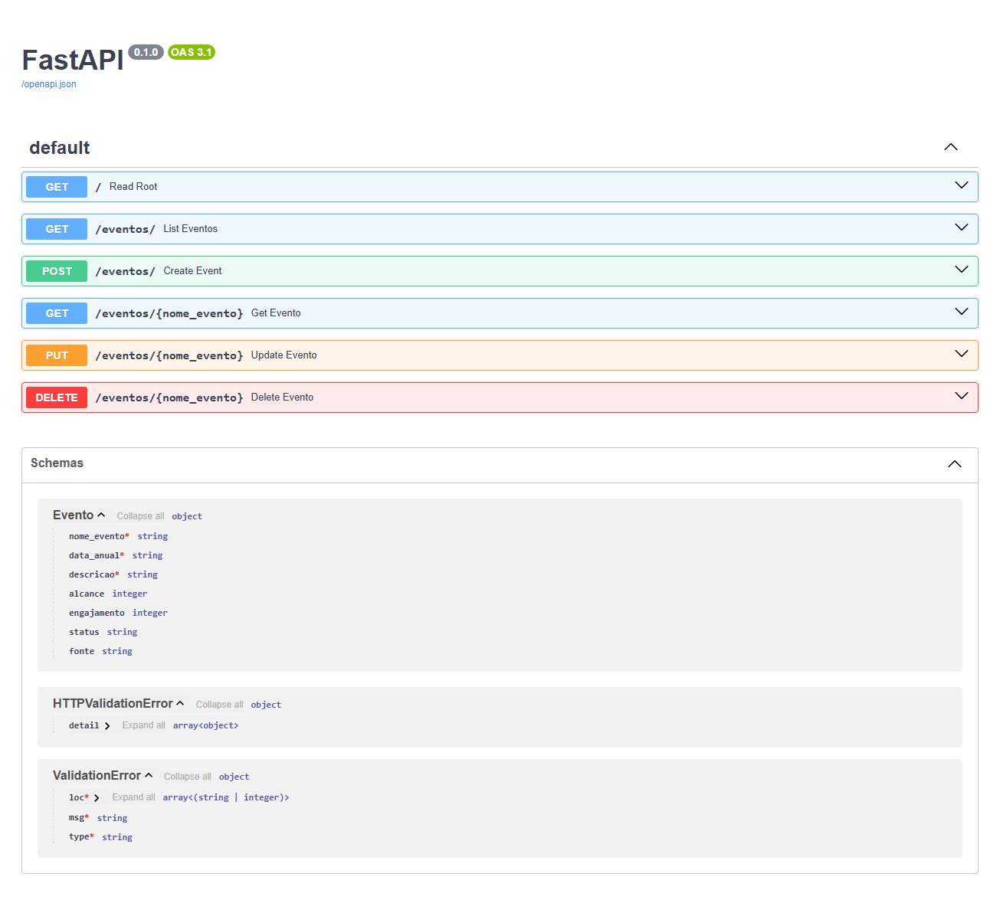

# Relatório Técnico: Orquestração de IA com n8n para Análise de Dados

O objetivo desse projeto é desenvolver uma Prova de Conceito (PoC) de um sistema de Business Intelligence, no qual o n8n centraliza a orquestração da migração de dados de planilhas para um banco de dados e atua como motor de uma aplicação de IA conversacional, permitindo que o usuário faça perguntas em linguagem natural e receba respostas precisas baseadas nos dados.

Ao clonar ou fazer o fork deste repositório, você encontrará a seguinte estrutura de arquivos:
```powershell
.
├── assets
├── postgres_data
├── docker-compose.yml
├── Dockerfile
├── main.py
└── requirements.txt
```


### Acessando a pasta do projeto pelo terminal
Para rodar o projeto, você precisa primeiro abrir um terminal ou PowerShell dentro da pasta que contém o arquivo `docker-compose.yml`. 

#### Existem duas formas fáceis de fazer isso:
- **Usando o comando cd**:  
No terminal, digite o comando `cd` (que significa "mudar diretório") seguido do caminho da pasta e pressione Enter.
Por exemplo: `cd C:\Users\SeuUsuario\Desktop\Projetos\Infraestrutura-Base`

- **Direto do Visual Studio Code**:  
Se você já usa o VS Code, pode abrir o terminal diretamente na pasta do projeto. O terminal já abrirá no local certo, pronto para ser usado.
    No menu superior, vá em `Terminal > New Terminal`.

### Como rodar o projeto
Primeiro deve abrir o docker desktop e acessar a conta cadastrada; o próximo passo é acessar a pasta do projeto (explicado anteriormente), chamada `Infraestrutura-Base`, que contém o arquivo `docker-compose.yml`, abrir um terminal e executar o comando `docker-compose up -d`. O docker-compose.yml está configurado para iniciar a API, o banco de dados e o n8n de uma vez, e eles continuarão rodando em segundo plano.

O comando `docker-compose up`: vai ler o arquivo `docker-compose.yml` e iniciar todos os serviços definidos nele:
  - Construindo a imagem da API; 
  - Baixar a imagem do banco de dados e do n8n;
  - Iniciar todos os containers. 
  
  A flag `-d` significa "detach", o que faz com que os containers rodem em segundo plano, permitindo o uso continuo do terminal. 
  
  Ou seja:
1. Abrir o Docker Desktop e acessar a conta cadastrada.
2. Acessar a pasta do projeto `Infraestrutura-Base`.
3. Executar o comando: `docker-compose up -d`

No terminal aparecerá algo assim:
```powershell
[+] Running 3/3
 ✔ Container postgres_cont       Running                                    0.0s 
 ✔ Container api_container       Running                                    0.0s 
 ✔ Container n8n_container       Running                                    0.0s             
```

#### Verificando o status dos containers
Para verificar o status dos containers execute o comando: `docker ps`, a saída mostrará os containers `api_container`, `postgres_container` e `n8n_container` listados e com o status `Up`.

No terminal aparecerá algo assim:
```powershell
CONTAINER ID   IMAGE                     COMMAND                  CREATED      STATUS          PORTS                                         NAMES
5042780ea0cf   infraestrutura-base-api   "uvicorn main:app --…"   2 days ago   Up 11 minutes   0.0.0.0:8000->8000/tcp, [::]:8000->8000/tcp   api_container
e58460cd6514   n8nio/n8n                 "tini -- /docker-ent…"   2 days ago   Up 11 minutes   0.0.0.0:5678->5678/tcp, [::]:5678->5678/tcp   n8n_container
6be4eeab5c5e   postgres:15               "docker-entrypoint.s…"   2 days ago   Up 11 minutes   0.0.0.0:5432->5432/tcp, [::]:5432->5432/tcp   postgres_container      
```

### Acessando os Serviços:
- **API**: estará disponível na porta `8000`. Pode testá-la acessando `http://localhost:8000` no seu navegador. A resposta deve ser:

  `{
    "status": "API está funcionando!"
  }`

- **n8n**: A instância do n8n estará disponível na porta `5678`. Acesse `http://localhost:5678` no seu navegador e faça login com as credenciais padrão: usuário `admingle` e senha `admingle123`.

- **PostgreSQL**: O banco de dados está na porta `5432`. Ele só é acessível pelos outros containers. Para interagir com ele, você pode usar uma ferramenta de banco de dados ou entrar no container com `docker exec -it postgres_container psql -U admingle -d meubanco`.

## Etapa 1: Estrutura do Projeto - Infraestrutura Base (Docker, Python, Postgres)

- **1° Passo**:  Criei o `arquivo docker-compose.yml`, responsável para iniciar a `API`, `banco de dados` e o `n8n`. A primeira instrução foi o banco de dados, contendo uma arquitetura simples apenas para suportar os dados disponibilizados.

  #### Estrutura do banco e tabela:
  Criei um banco de dados relacional no PostgreSQL para centralizar os dados de eventos que antes estavam dispersos em planilhas, para isso, utilizei o comando: `docker-compose exec postgres_container psql -U admingle -d meubanco`. 
  
  Dentro dele, criei a tabela `eventos`, que armazena informações de cada evento de forma organizada e padronizada. Usei uma tabela única, porque todos os dados possuem o mesmo contexto (eventos).

  ```powershell
  meubanco=# \d eventos
                                Table "public.eventos"
    Column    |  Type   | Collation | Nullable |               Default
  -------------+---------+-----------+----------+-------------------------------------
  id          | integer |           | not null | nextval('eventos_id_seq'::regclass) 
  nome_evento | text    |           | not null | 
  data_anual  | text    |           |          | 
  descricao   | text    |           |          | 
  alcance     | integer |           |          | 0
  engajamento | integer |           |          | 0
  status      | text    |           |          | 
  fonte       | text    |           |          | 
  Indexes:
      "eventos_pkey" PRIMARY KEY, btree (id)
  meubanco=# 
  ```
  A tabela foi criada de forma flexível para garantir que todos os dados vindos das planilhas integradas pelo n8n sejam inseridos no banco sem falhas, priorizando a demonstração do fluxo automatizado em vez da validação rígida dos dados.

- **2° Passo**: Criei o arquivo `main.py` que contém o código principal da API, construída com o framework `FastAPI`. 

  Nele, foram definidos os seguintes pontos:
  - Conexão com o banco de dados PostgreSQL, utilizando a biblioteca `psycopg2`.
  - Definição do modelo de dados Evento com `Pydantic`, que garante validação dos campos recebidos.
  - Implementação dos `endpoints` principais:
      - GET / — rota de teste
    - POST /eventos/ — cria evento
    - GET /eventos/ — lista eventos
    - GET /eventos/{nome_evento} — consulta evento
    - PUT /eventos/{nome_evento} — atualiza evento
    - DELETE /eventos/{nome_evento} — apaga evento

    Esse arquivo representa a camada de acesso aos dados, permitindo que a aplicação insira, consulte, atualize e remova registros no banco.

- **3° Passo**: Criei o arquivo `requirements.txt` para conter a lista de dependências necessárias, garantindo que a API funcione corretamente. O Docker utiliza esse arquivo para instalar automaticamente todas as bibliotecas no ambiente do container.

  Inclui as bibliotecas:
    - `fastapi` → framework web utilizado.
    - `uvicorn[standard]` → servidor ASGI para rodar a aplicação.
    - ` psycopg2-binary` → driver para conectar ao banco PostgreSQL.

- **4° Passo**: criei o arquivo `Dockerfile ` que define como a imagem da API deve ser construída. Esse arquivo garante que a API seja reproduzida em qualquer ambiente, de forma padronizada.

  Principais etapas configuradas:
  - Baseado na imagem oficial do Python 3.9 slim.
  - Configuração do diretório de trabalho /app.
  - Instalação das dependências a partir do requirements.txt.
  - Cópia do código da API para dentro da imagem.
  - Exposição da porta 8000, utilizada pelo FastAPI.
  - Comando para iniciar a aplicação com Uvicorn.

- **5° Passo**: Atualizei o arquivo `docker-compose.yml` para orquestrar os serviços. Nessa etapa, são iniciados dois containers, garantindo que o banco de dados e a API sejam executados de forma integrada, o que simplifica o gerenciamento:

  - Postgres: 
     - Banco de dados relacional para armazenar os eventos.
     - Configurado com usuário, senha e nome do banco via variáveis de ambiente.
     - Persistência dos dados através de volume mapeado.
  - API (FastAPI):
     - container construído a partir do Dockerfile.
     - Conectado ao banco de dados via variáveis de ambiente.
     - Porta 8000 exposta para acessar os endpoints da API.
     - Dependente do serviço do banco (depends_on).
    
  Acessando pelo link `http://localhost:8000` deve aparecer `{"status": "API está funcionando!"}` e pelo `http://localhost:8000/docs` aparece a documentação automática do FastAPI.
    

